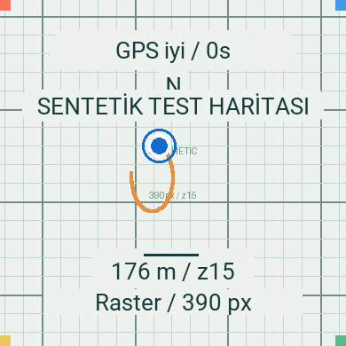

# FieldMap · Forerunner 165

Forerunner 165 için bağımsız Connect IQ saat uygulaması. Gerçek saat GPS’ini kullanır;
rota yüklemeden konum, yaş/kalite ve sınırlı hareket izi gösterir. Saatin düğmeleriyle
zoom, kaydırma, yeniden merkezleme ve tema seçimi yapılır.

**Bu teslim G0 teknik prototipidir.** Harita, açıkça etiketlenen sentetik test
ızgarasıdır; henüz gerçek sokak/patika haritası sağlayıcısı değildir. Derleme ve
yerel testler hazırlanmıştır. iPhone köprüsü, gerçek saat GPS/pil ölçümleri ve görsel
saha kabulü tamamlanmadan “sahada hazır MVP” iddiasında bulunulmaz. Gereksinim
belgesinin G0 → G1 → G2 → G3 geçiş koşulları korunur.

## Hızlı başlangıç

Python 3.12–3.14, mevcut Java 11+ ve Garmin Connect IQ SDK gerekir.
Python paketlerinin tamamı proje içindeki `.venv` ortamına kurulur.

```sh
make setup
make doctor
make test
make build-watch
make test-watch
```

SDK ve Forerunner 165 cihaz paketi için [kurulum yönergesi](docs/setup.md).
Garmin’in bu cihaz için gerçek derleyici kimliği **`fr165`**’tir.

**Saat dosyası:** `build/FieldMap.prg`. `make build-watch`, yerel simülatörün
`127.0.0.1` adresini fiziksel saat paketine taşımaz. HTTPS yapılandırması yoksa
paket çevrimdışı sentetik ızgarayla çalışır. GPS için START’a basmak gerekir.

## Simülatörde çalıştırma

Ağ servisi olmadan düğmeleri, GPS tekrarını ve arayüzü denemek için:

```sh
make sim-offline   # Açıkça etiketli yerel sentetik ızgara; ağ isteği yapmaz
```

Metadata servisini yerelde denemek için:

```sh
make dev-config    # Bir kez; .env ve .local/watch.json üretir. Sırları yazdırmaz.
make api           # Terminal 1: http://127.0.0.1:8765, sadece bu Mac
make sim           # Terminal 2: FieldMap-simulator.prg
```

`make dev-config` mevcut yapılandırmayı değiştirmez. `.env` veya `.local/watch.json`
zaten varsa bu adımı atlayın. Bu çalışma klasörü için yerel yapılandırma hazırlanmıştır.

Servis durumu: [yerel health](http://127.0.0.1:8765/health).
[OpenAPI arayüzü](http://127.0.0.1:8765/docs) ve [sürümlü sözleşme](contracts/openapi.json).
Simülatörde sentetik GPS için `tests/fixtures/synthetic-walk.gpx` dosyasını GPS
oynatma menüsünden seçin. Gerçek saate sentetik konum yüklenmez.

**Garmin görüntü dönüştürücüsü localhost PNG'sini alamaz.** Yerel HTTP deneyi
metadata ve API içindir; `makeImageRequest` yolunu doğrulamak için dışarıdan
erişilebilir HTTPS gerekir. Kullanıcı onaylı geçici HTTPS testi ile üç boyut
simülatörde doğrulandı. Tekrar için [HTTPS test planı](docs/https-simulator-test.md)
ve [ayrıntılı simülatör adımları](docs/field-test.md) bulunur. Hiçbir `make` görevi
kendiliğinden tünel açmaz.



## Düğmeler

| Eylem | Düğme |
|---|---|
| Haritayı aç; haritada menü | START |
| Zoom z14 / z15 / z16 | UP / DOWN |
| Menüde seç / gezin | START / UP / DOWN |
| Kaydırma modunda yön değiştir | START: kuzey-güney / doğu-batı |
| Kaydır; tek adımda konuma dön | UP/DOWN; BACK |
| Menüden haritaya dön | BACK |
| Harita oturumunu bitir | Haritada BACK veya menüde End session |

LIGHT ve sistemin uzun basma hareketleri yeniden atanmaz. Güncel raster RAM’de,
konum izi en fazla 180 noktada tutulur. GPS kesintisi izde bağlantısız segment
oluşturur. Beş saniyeden eski konum eski olarak gösterilir. Üç raster boyutu
menüden döndürülür: 390 → 195 → 256. G0 tanılama ekranı hata kodu, heap,
başarılı harita yükleme süresi ve sayaç gösterir; koordinat veya token yazmaz.
Depolama testi 1 KB metni yazıp okuyarak siler; toplam kapasite veya bitmap
kalıcılığı testi değildir.

## Proje düzeni

| Dizin | İçerik |
|---|---|
| `apps/watch` | Monkey C uygulaması, İngilizce/Türkçe kaynaklar, saat testleri |
| `services/api` | FastAPI, sentetik raster, kısa ömürlü görüntü yetkisi |
| `contracts` | OpenAPI ve sentetik istek örneği |
| `tests` | Koordinat, protokol, limit, erişim ve eşzamanlılık testleri |
| `scripts` | İzole kurulum, build, test, kanıt ve paketleme |
| `docs/evidence` | Ölçülen sonuçlar ve henüz yapılmayan saha testleri |

## Teslim ve devam

- [İlerleme ve bilinen eksikler](docs/progress.md)
- [G0 kanıt matrisi](docs/evidence/g0.md)
- [Gerçek saat kurulum ve saha listesi](docs/field-test.md)
- [Mimari kararlar](docs/decisions/001-g0-scope.md)
- [Gereksinim eşlemesi](docs/traceability.md)
- [Güvenlik ve veri akışı](SECURITY.md)

```sh
make audit         # Bilinen Python güvenlik açıkları; internet gerekir
make evidence      # Kanıtları mevcut test çıktılarından üretir
make package       # GitHub’a uygun kaynak ZIP’i; SDK/.venv/anahtar içermez
```

GitHub’a `.venv`, `.local`, `.env`, SDK, PRG, gerçek konum veya özel saha loglarını
yüklemeyin. Bunlar `.gitignore` ile dışlanır; kaynak ZIP’i yalnızca paylaşılabilir
dosyaları toplar. Otomatik CI Python testlerini çalıştırır; lisanslı Garmin
araçlarıyla saat doğrulaması yerel Mac’te yapılır. GitHub’a yayın/push veya Connect
IQ Store yüklemesi bu teslimde yapılmaz. Kod için ayrıca bir açık kaynak lisansı
seçilmemiştir.
