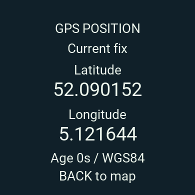

> Historical raster implementation, superseded by offline FieldGrid on 2026-09-15.
> Commands here are not the current watch workflow; use the [current README](../../README.md).

# FieldMap · Forerunner 165

English Connect IQ watch app with GPS coordinates, a bounded movement trace and
OpenStreetMap street/path maps supplied by **OpenFreeMap**. GPS works without a
phone or internet; downloading new map images needs Garmin Connect and internet.
The current OpenFreeMap implementation also needs a reachable HTTPS renderer.

**G0 prototype, simulator tested; physical Forerunner 165 / iPhone acceptance is
still NOT RUN.** The user requested the real map integration before physical G0
acceptance. This does not mark G0/G3 passed or claim field tested navigation.

## Start with offline GPS

Python 3.12–3.14, Java 11+ and Garmin SDK 9.2.0 / `fr165` device package:

```sh
make setup                  # Packages only inside project .venv
make doctor
make test
make build-watch            # build/FieldMap.prg
make test-watch
make sim-offline
```

See [setup](../setup.md). On this Mac, `.venv` and the SDK configuration already
exist. Press **DOWN on the home screen for GPS only**. Latitude and longitude use
six decimal places in WGS84, with fix age and Current/Last known status. No fix is
shown as `--`. Displayed decimal places are not a GPS accuracy guarantee. The
GPS only session makes no map/network requests and does not save location history.

In the simulator, explicitly load a synthetic GPX through Simulation → Activity
Data; [instructions](../field-test.md). The physical watch uses its own GPS,
never the test fixture. START opens a normal map session instead.



## Free real maps: what the URL and token mean

[OpenFreeMap](https://openfreemap.org/) is free, with no registration, API key or
request/view quota. Its public service has no SLA. It provides **vector tiles,
not PNGs** ([upstream limitations](https://github.com/hyperknot/openfreemap#limitations-of-this-project)).
Our Python service converts only the visible area into a small 16-color PNG for
the watch. The watch does not download a vector database or city map package.

```dotenv
FR165_MAP_PROVIDER=openfreemap
FR165_PUBLIC_BASE_URL=http://127.0.0.1:8765
```

`FR165_PUBLIC_BASE_URL` is the address of **your raster converter**, not OpenFreeMap.
`127.0.0.1` means this Mac only. Local HTTP is useful for API development, but the
Garmin image converter cannot fetch a localhost PNG. A reachable **HTTPS renderer**
is required for online maps on the watch. Changing the URL to `openfreemap.org`
will not work because it is a different API.

`FR165_DEV_TOKEN` protects your own renderer; it is not a map provider API key,
subscription or charge. The provider receives no such token. Local rendering is
limited to 30 jobs/minute to prevent resource abuse; this is an application guard,
not an OpenFreeMap account quota. The watch starts at most one job per five seconds.

```sh
make dev-config             # First setup only; existing private files are preserved
make api                    # Terminal 1: local renderer
make sim                    # Terminal 2: configured watch build
```

OpenFreeMap is the default provider. Set `FR165_MAP_PROVIDER=synthetic` explicitly
for test grids. Provider failures preserve the last map and GPS; they never replace
real maps with a synthetic grid. `make sim-offline` is an explicit local test mode.

A tunnel is temporary development access: the Mac must stay awake and online.
Permanent hosting is a separate choice; no paid account or permanent deployment
has been created. [HTTPS test plan](../https-simulator-test.md).

The physical test successfully displayed maps and refreshed with a locked iPhone,
but its authorized 30-minute tunnel has closed. The installed test URL no longer
serves maps. This is separate from Bluetooth pairing. Alternatives that remove
the Mac are assessed in [phone only map options](../phone-only-maps.md);
they have not been implemented or activated.

On map credits now use one 18 px line, with full source links in Map credits.
The compact layout passes local day/night checks and is not yet installed on the
physical watch. [UI evidence](../evidence/compact-attribution/result.json).

## Controls

| Action | Button |
|---|---|
| Home: start offline GPS coordinates | DOWN |
| Home: start map session | START |
| Map: menu | START |
| Map: zoom z14 / z15 / z16 | UP / DOWN |
| Menu: move / select | UP / DOWN, then START |
| Browse: choose north–south / east–west axis | START |
| Browse: pan / return to following | UP / DOWN, BACK |
| Coordinates, credits or menu: return to map | BACK |
| Map: stop session, clear trace and release image | BACK |

Menu includes theme, 195/256/390 image size, diagnostics, a safe 1K storage probe,
GPS coordinates and map credits. UI remains English regardless of watch language.

## Bounded resource use

- Watch: 180 trace points; one active native raster, at most one incoming native
  raster and its paletted download during conversion; single network job and
  timeout/backoff. See [FR165 graphics format](../decisions/005-fr165-native-raster.md).
  GPS continues while
  new maps are paused for low memory. No persistent map cache or GPS history.
- Preferences: one small key, rewritten only when values change. Storage probe
  writes, compares and removes 1024 ASCII characters; it is not a capacity test.
- Renderer: at most 9 visible area tiles per view; 1 MiB each, 16 cached tiles AND
  8 MiB total compressed cache, one decoded tile at a time, one render at a time,
  18-second deadline, at most 64 KiB PNG, 24 short lived output images. No disk tiles.

[Measured results and limits](../evidence/g0.md) distinguish accelerated event
stress from real elapsed time, physical RAM and battery testing.

## Delivery

```sh
make audit                  # Online dependency vulnerability check
make contracts              # Regenerate OpenAPI
make evidence               # Current artifacts + observed tests, never physical PASS
make package                # Shareable source ZIP
```

[Progress](../progress.md) · [Architecture decision](../decisions/004-openfreemap-and-offline-position.md)
· [Requirements traceability](../traceability.md) · [Security](../../SECURITY.md)

Source ZIP: `dist/FieldMap-G0-source.zip`. Watch file: `build/FieldMap.prg`.
Git ignores `.venv`, `.local`, `.env`, SDK/build outputs and private logs. Do not
upload the whole folder through an interface that ignores `.gitignore`; use Git or
the source ZIP. No GitHub push or Connect IQ Store publication is performed here.
No source code license has been chosen; map data attribution/licenses still apply.
