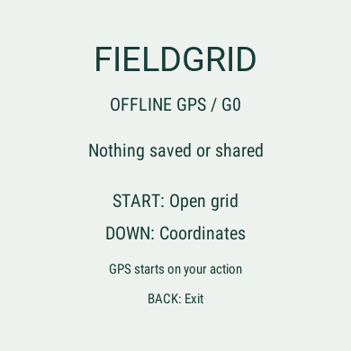
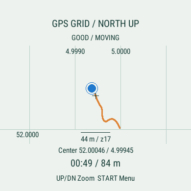
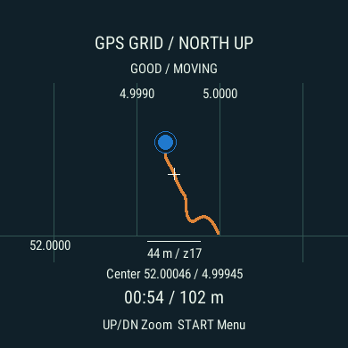
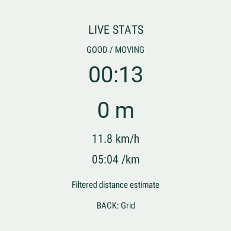
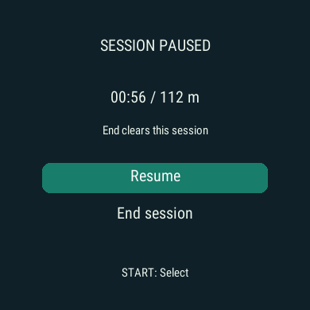
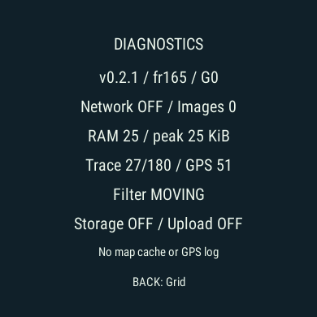

# FieldGrid G0 v0.2.1 — local only evidence

15 September 2026. This is the active delivery. The user chose an offline grid and
live information without recording or transmitting session data (ADR 007).

| Check | Result | Evidence and limits |
|---|---|---|
| Python | PASS | 93 tests, 96% legacy API coverage; two upstream deprecation warnings |
| Watch build | PASS | SDK 9.2.0, `fr165`, zero warnings |
| Watch tests | PASS | 20 tests; synthetic input only |
| English UI | PASS | Native 390×390 simulator captures below |
| USB installation | PASS | Actual Forerunner 165; PRG readback equals local binary |
| Physical launch / grid display | PASS | User reports "The grid opened without an error (translated user report)"; no IQ error |
| Physical GPS accuracy / explicit end state check | NOT RUN | Not independently measured or explicitly reported |
| Physical endurance / battery / drift | NOT RUN | Requires outdoor observation with this build |
| Full physical G0 / G3 | NOT RUN | Local tests and USB transfer do not pass these gates |

The installed executable is **119,084 bytes** (about 116 KiB). SHA-256:
`e3f29827ddae900b2ab56dd6a9f1c9b8671a25351d04624ed8418075b37d8fc1`.
It has only Positioning permission. It uses no map image, network/phone API, native
activity recorder, saved FIT, session file or new application storage write.
Upgrade cleanup removes only three obsolete app owned keys. Garmin's independent
health/activity recording and sync settings are outside this app.

The display filter holds stationary jitter: 600 synthetic fixes within ±3 m produce
one trace point and zero distance. The moving trace is capped at 180 points, with a
three sample filter. Gaps, weak fixes and rejected jumps do not invent distance.
Slow walking remains covered by regression tests; actual outdoor drift and delay
are not inferred from synthetic results.

Stress checks: 30 trace sessions / 30,000 fixes (54,728 B peak test heap), 1,000
redraws and a sharp turn (56,816 B), and 40 real simulator GPS subscription
start/stop cycles / 12,000 fixes (35,464 B maximum post stop heap). Post warm up
growth is bounded by the asserted 512 B allowance. These include the test harness;
the production diagnostics snapshot shows 25 KiB used/peak. None is a physical
battery measurement or a measure of all OS/native allocations.

Pause releases GPS and the redraw timer. Resume continues the in memory session
with a gap; End and app exit release coordinates, trace and live values. A system
interruption stops GPS/timer; an active session resumes in foreground without
guessing the missing path. No session survives app exit.

Commands, artifact/source identities and measurements: [result](result.json),
[test output](watch-tests.txt), [USB readback](physical-install.json), [user confirmation](physical-user-check.json),
[review](review.md), [source package validation](../source-package.json).
Remaining physical checks: [field checklist](../../grid-field-test.md).

## Synthetic simulator screenshots

All coordinates and movement below came from explicitly enabled Garmin simulator
data, not the user's location. The captured simulator PRG has the same SHA-256 as
the installed production PRG. Session was ended and simulator closed afterward.

