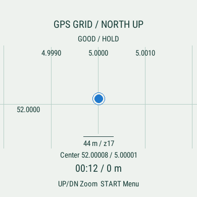
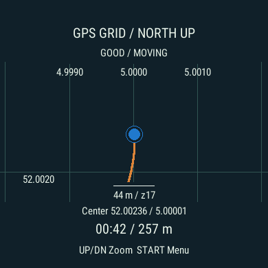
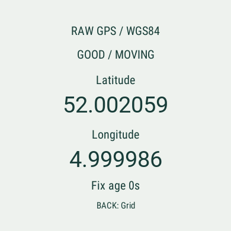
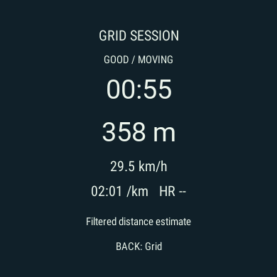
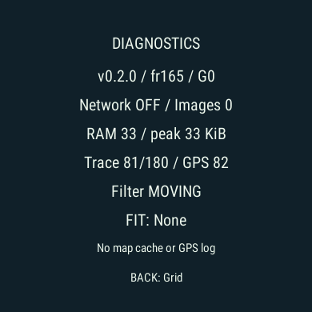

> Historical v0.2.0 grid/FIT prototype; superseded by [v0.2.1 local only evidence](../grid-only/README.md).
> The retention question is resolved: no recording, no sync, no uploads.

# FieldGrid G0 evidence — 2026-09-15

**Local implementation PASS; physical grid/FIT acceptance NOT RUN.** No new watch
installation. Automatic saved FIT deletion after sync is unavailable in the SDK;
recording retention is awaiting the user's choice. See [ADR 006](../../decisions/006-offline-grid-and-fit.md).

| Check | Result |
|---|---|
| `make test` | PASS — 92 tests; legacy API line coverage 96% |
| `make build-watch` | PASS — fr165, SDK 9.2.0, zero warnings |
| `make test-watch` | PASS — 23 tests |
| Extracted source ZIP | PASS — 92 tests, new fr165 build, identical watch source hash |
| Stationary noise | PASS — 600 synthetic +/-3 m samples, one trace point, zero distance |
| Slow walk / walk / run / bike like speed | PASS — synthetic 0.35 / 1.4 / 4 / 12 m/s cases |
| Trace stress | PASS — 30 sessions, 30,000 samples; 180-point bound |
| Draw/turn stress | PASS — 1,000 redraws with 90-degree turn |
| GPS lifecycle | PASS — 40 subscriptions/start/stop, 12,000 samples, released trace/timer |
| Native FIT session API | PASS — start/pause/resume/save/discard; four sport types |
| Save/stop/discard failures | PASS — injected failures retain pending handle |
| Application persistence | PASS — old keys removed; no preferences/GPS history writes |
| English round screen layout | PASS — unit render/width checks and native screenshots |
| Actual watch FIT upload/deletion, endurance, battery/storage | NOT RUN |

Current program is **124,668 bytes**. Hashes and exact source identity are in
[result.json](result.json); complete test output is in [`watch-tests.txt`](watch-tests.txt).
The physical build still uses `FieldMap.prg` for upgrade compatibility, with display
name FieldGrid G0. The executable cannot embed former private URL/token resources.

Measured **test process** heap peaks: trace stress 59,496 B; redraw stress 62,096 B;
post stop lifecycle 42,880 B. After warm up, lifecycle samples stayed within the
asserted 512 B allowance. These include the test framework and do not measure all
native graphics memory, FIT storage or physical power. Interactive grid only app
samples were about 25–38 KiB, depending on trace length; finishing returned the
sample to about 27 KiB. They are not a two hour endurance result.

Saved FIT activity files are deliberately different from app cache/preferences.
They must exist to sync through Garmin Connect, and this app cannot detect a
completed upload or delete an already saved FIT. Nothing is deleted from the user's
watch or account. `discard()` removes an unfinished recording only.

Final screenshots below use **SYNTHETIC Garmin simulator data**, not the user's GPS.
Earlier `synthetic-*.png` files show the preceding local UI; their source identity is
recorded separately. The current source adds explicit GOOD/USABLE labels and corrects
peak display sampling. `final-*.png` belongs to the current source.

Initial build/test errors (callback signatures, test only bitmap constructor,
annotation and missing import) were corrected, then the complete tests rerun.
Two upstream Python deprecation warnings remain. No public service was started.
