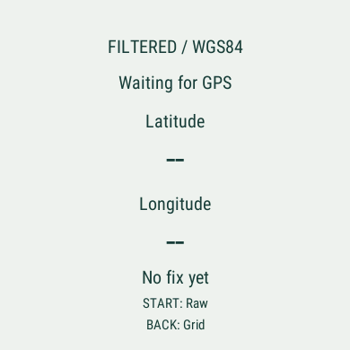
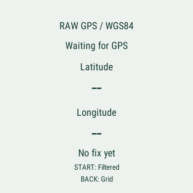
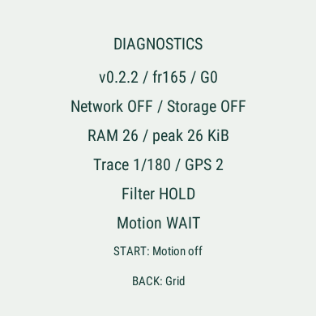

# Stationary filter and motion assistance evidence

Version 0.2.2, Forerunner 165, SDK 9.2.0. All automated input is synthetic.
The user authorized other watch sensors after reporting stationary GPS drift.
The later field report confirms improvement but not full stationary suppression;
see the [v0.2.3 follow up](../wrist-motion/README.md).

| Check | Result |
| :--- | :--- |
| v0.2.1 stationary field behavior | FAIL by user report: marker and distance moved during 12 to 34 m drift |
| Regression before the fix | 20 PASS; two assertion errors reproduced the defect |
| Python suite | 116 PASS; two existing dependency deprecation warnings |
| fr165 watch suite | 32 PASS |
| Production build | PASS, zero warnings |
| Installed executable | 125,260 bytes; verified by identical physical USB readback |
| Physical stationary behavior | FAIL by later user report: 7 to 11 m drift with small arm movement |
| Physical battery and complete G0/G3 | NOT RUN |

See [result.json](result.json), [physical installation](physical-install.json),
[watch output](watch-tests.txt), [baseline failures](baseline-watch-tests.txt),
[review](review.md) and [ADR 008](../../decisions/008-stationary-motion-assist.md).

## What the regressions establish

The GPS only fix holds a 34 m stationary ramp, plateau and reversal with low speed.
It rejects isolated speed spikes and does not add the held GPS offset when walking
resumes. Slow walks at 0.35 m/s, missing speed, sparse fixes, ordinary walking,
running, cycling speed, turns, date line and relocation remain covered.

With synthetic still acceleration, the marker and distance stay fixed even when
GPS falsely reports 1.4 m/s. Synthetic gait at 0.35 m/s remains responsive. Step
expiry, midnight, missing values, zero gravity input, broken batches and stale
sensor fallback are tested. This is evidence about these inputs, not a guarantee
against all real GPS drift or every wrist posture.

Thirty sessions process 30,000 GPS fixes, the redraw test processes 1,000 updates,
and 40 GPS lifecycle loops process another 12,000 fixes. Twenty added sensor loops
process 12,000 batches / 300,000 acceleration samples. After warm up, retained heap
stays within the existing 512 byte lifecycle bound. Maximum measured test heap is
68,208 bytes. The larger test program includes all 32 tests; this is not production
RAM or physical sensor power consumption. Production diagnostics showed 26 KiB
used/peak in a short interactive run with Motion WAIT.

## Screen review

Native 390 by 390 captures below show the new English controls and no fix handling.
A filtered screen with numeric synthetic coordinates and stale status was also
visually inspected during replay setup. The automated rendering test exercises
numeric values, both themes and every page, including the new labels.

The interactive simulator did not provide a sustained valid GPS/accelerometer
stream in this run. Its data source changed during setup, and quality initially
reported Last Known. Two GPS callbacks were observed; that is not a successful
continuous replay or a native sensor delivery test. Motion WAIT correctly uses
GPS fallback. Continuous motion behavior is supported by the synthetic regression
suite only, pending the physical test. No real location or daily step total was
captured. Session End returned to home with Session cleared.

## Commands and limitations

- `make test`: PASS, 116 tests.
- `make build-watch`: PASS for `fr165`, no warnings.
- `make test-watch`: PASS, 32 tests, after the known local simulator permission
  retry. The baseline run is retained as FAIL; it was not overwritten by success.
- `make sim-offline`: native English control and screen review, synthetic input
  only. Continuous stream delivery remains unverified as described above.
- USB command line queries returned an empty inventory, while OpenMTP exposed the
  physical Forerunner 165. Transfer and identical readback succeeded through MTP.
- No firmware, account, network, paid provider, public deployment or global package
  changes. No recording API, application storage writer or phone API was added.
